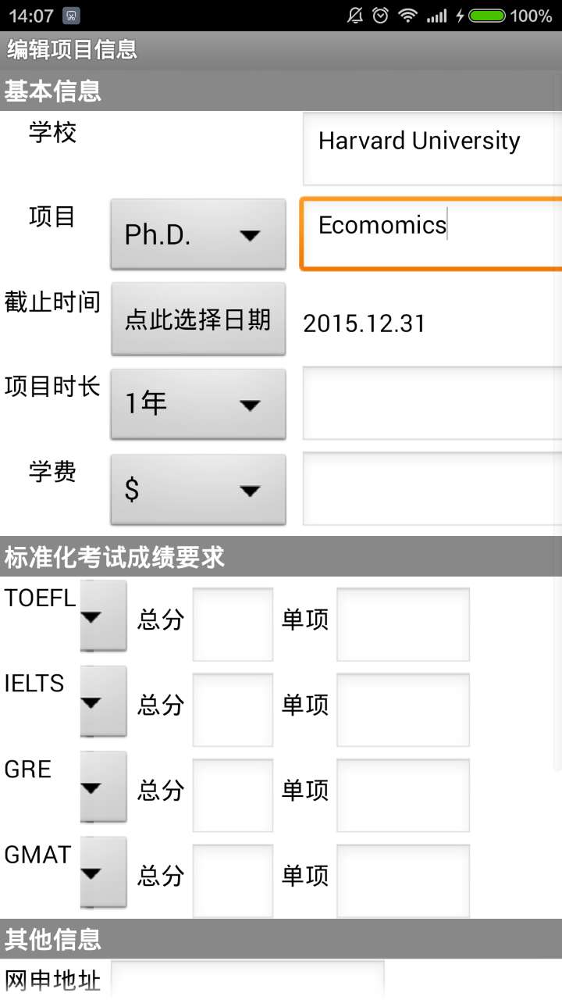
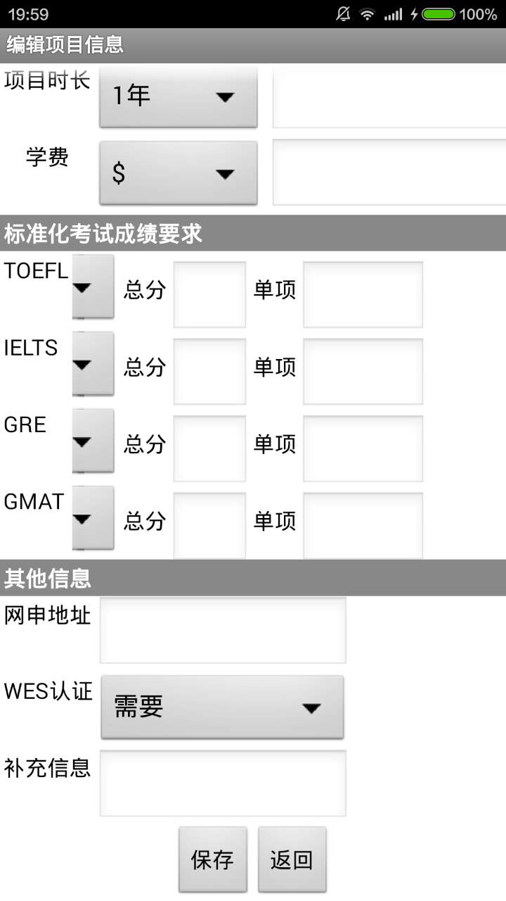

## 3.2 具体功能模块设计

### (3) 第二个屏幕的设计

第二个屏幕的功能模块用于录入每个项目的具体信息，分为三个部分：

基本信息包括学校、项目、截止时间（通过日期选择框）、项目时长和学费。

标准化考试要求包括TOEFL, IELTS, GRE, GMAT的总分和单项要求。

其他信息包括网申地址、成绩单的WES认证和补充信息等。

这一屏幕通过下拉框预设了大量的可选项：项目可以选择学位类型、项目时长可以选择常见长度、学费可以选择货币单位；标准化考试可以选择学校对成绩的要求（要求、不要求、可选）。

屏幕下方设有保存按钮，用于将录入的信息存入微数据库，点击后将弹出对话框表明保存成功；还设有返回按钮，用于返回主界面。

