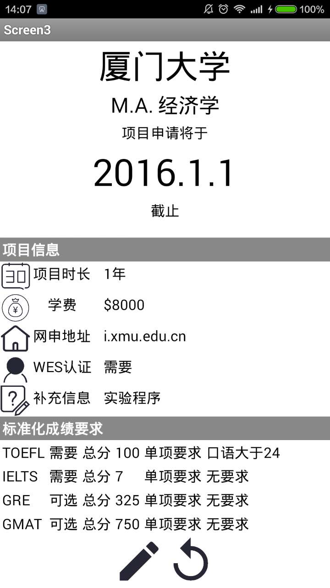

## 3.2 具体功能模块设计

### (3) 第三个屏幕的设计

第三个屏幕用于显示录入的项目的详细信息。第一个屏幕每个条目的显示详情按钮都会传递一个特定的编码到第三个屏幕，用于从微数据库中读取相应标签的内容。屏幕上方以大号字显示学校名称和截止时间；屏幕下方设有编辑按钮和和返回按钮。按下编辑按钮后，将进入第二个屏幕的编辑页面，同时传递当前对应的编号到第二个屏幕，以从数据库中读取已经录入的信息，避免全部重新编辑的问题。点击返回按钮将回到第一个屏幕。

